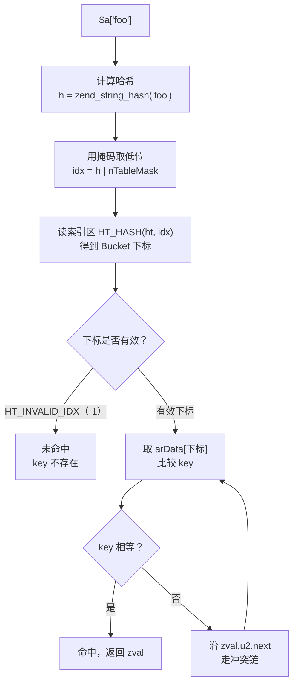
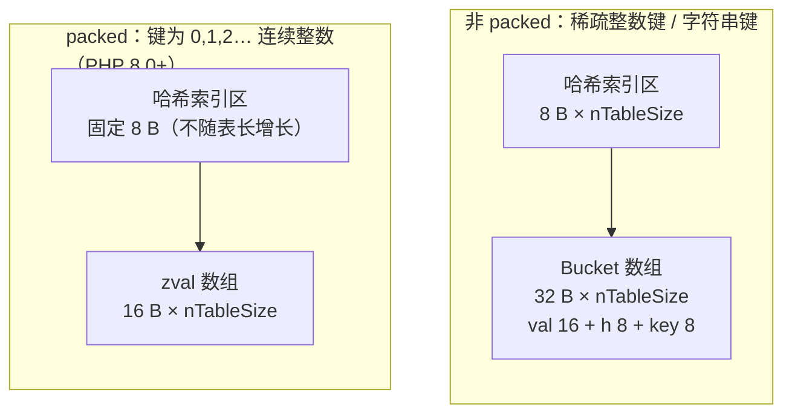

# PHP 高级工程师面试题 · 答案整理

> 配套 `php-senior-interview-top50.md`，逐题整理答案。
>
> 本文数据的来源：**PHP 8.2.33 实测**（Docker `php:8.2-cli`，64 位）+ **php-src `PHP-8.2` 分支源码核对**。凡标「实测」的数字，文末附有可复现脚本。

---

## Q1. PHP 数组的底层结构是什么？为什么说它内存占用大？

### 一句话结论

PHP 数组不是数组，而是**有序哈希表**（HashTable，语义上等同 Python 的 `dict`）。它内存大，是因为每个元素都要存一个完整的 `zval`（16 字节）**再加上**哈希元数据，而 C 的 `int` 数组每元素只要 4 字节。

---

### 一、底层结构

#### 1. 整体内存布局

`emalloc` 一次性分配一整块连续内存，前半段是哈希索引区，后半段是 Bucket 数组，`arData` 指针指向两者的交界处：

```
                            ┌───────────────────────────────┐
  ht->arHash ───────────────► HT_HASH(ht, nTableMask)       │ ─┐
  （指向索引区，用负偏移访问） │ HT_HASH(ht, nTableMask + 1)   │  │  哈希索引区
                            │ ...                           │  │  2 × nTableSize 个
                            │ ...                           │  │  uint32_t
                            │ HT_HASH(ht, -1)               │ ─┘  = 8 字节 / 槽位
                            ├───────────────────────────────┤
  ht->arData ───────────────► Bucket[0]   val │ h │ key     │ ─┐
                            │ Bucket[1]   val │ h │ key     │  │  Bucket 数组
                            │ ...                           │  │  按插入顺序存放
                            │ Bucket[nTableSize - 1]        │ ─┘  32 字节 / 槽位
                            └───────────────────────────────┘
```

```
┌──────────────────────────────────────────────────────────┐
│ struct _zend_array（HashTable 头，56 字节）                │
│   gc(8) │ flags(4) │ nTableMask(4) │ arData(8)            │
│   nNumUsed(4) │ nNumOfElements(4) │ nTableSize(4)          │
│   nInternalPointer(4) │ nNextFreeElement(8) │ pDestructor(8)│
└──────────────────────────────────────────────────────────┘
```

| 字段 | 作用 |
| --- | --- |
| `arData` | 指向 Bucket 数组首地址 |
| `nTableSize` | 容量，**必须是 2 的幂** |
| `nTableMask` | `-(nTableSize + nTableSize)`，用于把哈希值映射成负偏移 |
| `nNumUsed` | 已使用的槽位数（含被 `unset` 的墓碑） |
| `nNumOfElements` | 有效元素个数（`count()` 返回它） |

> `nNumUsed` 和 `nNumOfElements` 是两个不同的值 —— 这正是「`unset` 不释放内存」的原因。

#### 2. Bucket 的结构

```c
typedef struct _Bucket {
    zval         val;   // 16 字节：值 + 类型信息 + 引用计数
    zend_ulong   h;     //  8 字节：哈希值
    zend_string *key;   //  8 字节：字符串键指针（整数键为 NULL）
} Bucket;               //  合计 32 字节
```

```
  Bucket (32 B)
  ┌──────────────┬──────────┬──────────┐
  │  zval (16 B) │  h (8 B) │ key (8 B)│
  └──────────────┴──────────┴──────────┘
     值+类型        哈希值    字符串键指针
```

`zval` 内部（16 字节）：

```
  ┌────────────────────┬─────────────────────┐
  │  value (8 B)       │  u1.type_info (4 B) │
  │  联合体：long/str/ │  类型 + 类型标志位   │
  │  arr/obj/double…   │  + 2 B 预留          │
  └────────────────────┴─────────────────────┘
```

**关键点**：哈希冲突用拉链法解决，但 `next` 索引**不额外占字段**，而是复用了 `zval.u2.next` —— 这是 PHP 省内存的一个设计。

#### 3. 查找过程



### 二、每槽位的真实开销

| 数组类型 | 每槽位 | 构成 |
| --- | --- | --- |
| 非 packed（稀疏键 / 字符串键） | **40 B** | Bucket 32 + 哈希索引区 8 |
| packed（PHP 8.0+，连续整数键） | **16 B** | 纯 `zval` 数组，索引区固定 8 字节 |

> **容易答错的细节**：哈希索引区是 **8 字节/槽位**，不是 4。
> 源码里 `HT_SIZE_TO_MASK` 定义为 `-(nTableSize + nTableSize)`，索引区长度是**表长的 2 倍**，每项 `sizeof(uint32_t)` = 4 字节，所以 2 × 4 = 8 字节/槽位。
> 很多资料写「4 字节」是把 mask 记成了 `-nTableSize`，这是错的 —— 实测数据可以反证（见下）。

### 三、实测数据

**PHP 8.2.33，64 位，10 万元素：**

```
C 的 int32 数组      ▏ 4.0 B
SplFixedArray       ████▏ 16.0 B
packed 连续整数键     █████▏ 21.0 B        $a[] = $i
稀疏整数键           █████████████▏ 52.4 B   $a[$i * 2] = $i
短字符串键           █████████████████████▏ 84.4 B      "k$i"
长字符串键(21字符)   ███████████████████████████▏ 108.3 B
```

**验算**（10 万元素时 `nTableSize` = 131072，倍率 131072 / 100000 = 1.31）：

| 场景 | 计算 | 实测 |
| --- | --- | --- |
| packed | 16 × 1.31 | **21.0** ✓ |
| 稀疏整数键 | 40 × 1.31 | **52.4** ✓ |
| 短字符串键 | 40 × 1.31 + 32（`zend_string`） | **84.4** ✓ |
| 长字符串键 | 40 × 1.31 + 56（`zend_string`） | **108.3** ✓ |

注意字符串键的开销是**按元素个数**算的（每个 key 一个 `zend_string`），而不是按 `nTableSize` 算 —— 这解释了为什么字符串键的实测值不能用「每槽位 × 1.31」直接推出来。

`zend_string` 的结构：

```c
struct _zend_string {
    zend_refcounted_h gc;   // 8
    zend_ulong        h;    // 8  缓存的哈希值
    size_t            len;  // 8
    char              val[1];  // 柔性数组，内容
};                          // 24 字节头 + 内容，向上取整到内存分配器的档位
```

### 四、为什么内存大 —— 六个原因

1. **每个元素是完整 `zval`（16 字节）**，带类型信息与引用计数，不是裸值。C 的 `int` 只要 4 字节。
2. **Bucket 还要存 `h`(8) 和 `key` 指针(8)**，即每个元素 32 字节起步。
3. **哈希索引区 8 字节/槽位**（2 倍表长 × 4 字节）。
4. **`nTableSize` 必须是 2 的幂**：10 万元素实际分配 131072 槽，仅此一项就浪费约 31%。
5. **容量只增不减**：`nTableSize` 永不收缩；`unset` 只是把 `zval` 标记为 `IS_UNDEF`（墓碑），既不移位也不归还内存。
   *实测：把 10 万元素的数组全部 `unset` 后，内存占用仍是 21 B/元素，一点没还。*
6. **字符串键额外分配 `zend_string`**：24 字节头 + 内容，再向上取整到分配器档位（短键实际 32 字节）。

**对比**：C 的 `int32` 数组 4 字节/元素，PHP 稀疏整数键 52 字节 —— **相差 13 倍**。

### 五、PHP 7 / PHP 8 做的优化



- **PHP 7**：`zval` 从 24 → 16 字节；Bucket 从「每个单独 `emalloc` + 指针链表」改为「一整块连续数组 + 索引」，内存约减半，且缓存友好（这是 PHP 7 性能提升的主要原因之一）。
- **PHP 8.0 packed array**：当键是 `0,1,2…` 连续整数时，`arData` 退化成纯 `zval` 数组，且哈希索引区**不随表长增长**（固定 8 字节）。
  实测同样 10 万个整数元素：**packed 21 字节 vs 非 packed 52 字节，省 60%**。
  触发条件：从空数组开始用 `$a[] = x` 追加，或键恰好是连续递增整数。

### 六、实战结论

| 场景 | 选择 |
| --- | --- |
| 海量数值、长度固定 | `SplFixedArray`（实测 16 B/元素，接近 C 数组） |
| 只判断存在性 | 位图（字符串按位存） |
| 大文件 / 大结果集 | 生成器（`yield`）流式处理，**不要**一次性塞进数组 |
| 对象集合 | `SplObjectStorage` |
| 避免 | 把关联数组当「结构体」批量传递大对象 |

**删除大量元素后想真正回收内存**：只能重建数组（`array_values()` 或重新赋值），或者 `unset` 整个数组让引用计数归零。

### 七、可能的追问

| 追问 | 要点 |
| --- | --- |
| 为什么 PHP 数组是有序的？ | `arData` 按插入顺序连续存放，删除只打 `IS_UNDEF` 墓碑、不搬移其他元素 |
| 哈希冲突怎么解决？ | 拉链法；`next` 索引复用 `zval.u2.next`，不额外占字段 |
| 扩容机制？ | 元素数达到 `nTableSize` 时翻倍（始终 2 的幂），并重建哈希索引区 |
| 数组的 key 为什么只能是 int / string？ | 其他类型会隐式转换：`float` 截断为 int（PHP 8.1 起弃用）、`bool` → int、`null` → `""` |
| `count()` 的时间复杂度？ | O(1)，直接返回 `nNumOfElements` |
| 为什么 `foreach` 比 `for` 快？ | `foreach` 直接遍历 `arData` 的连续内存，`for` 每次都要走一次哈希查找 |
| 遍历时用引用 `&$v` 有什么坑？ | 遍历结束后 `$v` 仍指向最后一个元素，后续复用该变量会污染数组 |

---

### 附：数据复现脚本

```php
<?php
// 保存为 arr_mem.php，运行：docker run --rm -v $PWD:/t php:8.2-cli php /t/arr_mem.php
$N = 100000;
printf("PHP %s, %d-bit\n\n", PHP_VERSION, PHP_INT_SIZE * 8);

$m = memory_get_usage(); $a = []; for ($i=0;$i<$N;$i++) $a[] = $i;
printf("packed 连续整数键      : %6.1f B/元素\n", (memory_get_usage()-$m)/$N); unset($a);

$m = memory_get_usage(); $b = []; for ($i=0;$i<$N;$i++) $b[$i*2] = $i;
printf("稀疏整数键             : %6.1f B/元素\n", (memory_get_usage()-$m)/$N); unset($b);

$m = memory_get_usage(); $c = []; for ($i=0;$i<$N;$i++) $c["k$i"] = $i;
printf("短字符串键             : %6.1f B/元素\n", (memory_get_usage()-$m)/$N); unset($c);

$m = memory_get_usage(); $d = []; for ($i=0;$i<$N;$i++) $d[str_repeat('k',20).$i] = $i;
printf("长字符串键             : %6.1f B/元素\n", (memory_get_usage()-$m)/$N); unset($d);

$m = memory_get_usage(); $e = new SplFixedArray($N); for ($i=0;$i<$N;$i++) $e[$i] = $i;
printf("SplFixedArray          : %6.1f B/元素\n", (memory_get_usage()-$m)/$N); unset($e);

$m = memory_get_usage(); $g = range(1,$N); $alloc = memory_get_usage()-$m;
for ($i=0;$i<$N;$i++) unset($g[$i]);
printf("range 分配             : %6.1f B/元素\n", $alloc/$N);
printf("全部 unset 后仍占用    : %6.1f B/元素（空间不归还）\n", (memory_get_usage()-$m)/$N);
```

**反推每槽位字节数的技巧**：构造规模为 2 的幂的数组，测量相邻两档的内存差，除以半档元素数，即可得到精确的每槽位开销（因为 `nTableSize` 正好翻倍，不受取整干扰）。用这个方法测出 16 / 40 / 72 三个整数，才敢确定 packed=16、非 packed=40。
