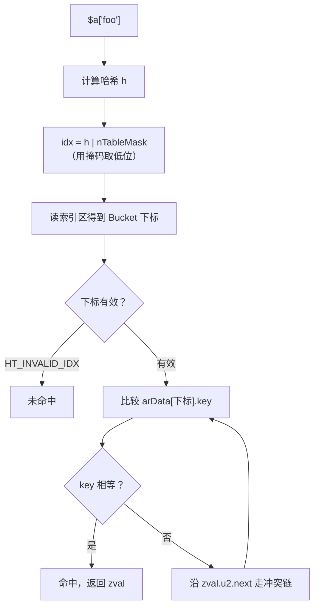

# PHP 高级工程师面试题 · 答案整理

> 配套 `php-senior-interview-top50.md`。
> 数据来源：PHP 8.2.33 实测（`php:8.2-cli`，64 位）+ php-src `PHP-8.2` 源码核对。

---

## Q1. PHP 数组的底层结构是什么？为什么说它内存占用大？

### 结论

PHP 数组不是数组，是**有序哈希表**。内存大是因为每个元素要存一个完整的 `zval`（16 B）**再加**哈希元数据；而 C 的 `int32` 数组只要 4 B/元素，实测差 **13 倍**。

### 一、底层结构

`emalloc` 一次性分配一整块连续内存：前半段哈希索引区，后半段 Bucket 数组，`arData` 指向交界处。

```
                      ┌────────────────────────────┐
   ht->arHash ───────►│ HT_HASH(nTableMask)        │ ─┐
                      │ ...                        │  │ 哈希索引区（负偏移访问）
                      │ HT_HASH(-1)                │ ─┘ 8 B/槽位
                      ├────────────────────────────┤
   ht->arData ───────►│ Bucket[0]   zval│h│key     │ ─┐
                      │ Bucket[1]   zval│h│key     │  │ Bucket 数组
                      │ ...                        │  │ 按插入顺序存放
                      │ Bucket[nTableSize-1]       │ ─┘ 32 B/槽位
                      └────────────────────────────┘
                          nTableSize 必须是 2 的幂
```

**Bucket（32 B）**：

```
 ┌───────────────┬──────────┬───────────┐
 │  zval (16 B)  │  h (8 B) │ key (8 B) │
 │ 值+类型+引用计数 │  哈希值   │ 字符串键指针 │
 └───────────────┴──────────┴───────────┘
```

- 整数键时 `key` 为 `NULL`
- 哈希冲突用**拉链法**，`next` 索引复用 `zval.u2.next`，不额外占字段
- 数组有序的原因：Bucket 按插入顺序连续存放，删除只打 `IS_UNDEF` 墓碑、不搬移其他元素

**查找过程**：



### 二、每槽位开销

| 数组类型 | 每槽位 | 构成 |
| --- | --- | --- |
| 非 packed（稀疏键 / 字符串键） | **40 B** | Bucket 32 + 索引区 8 |
| packed（PHP 8.0+，连续整数键） | **16 B** | 纯 `zval` 数组 + 固定 8 B 索引区 |

> 索引区是 **8 B/槽位，不是 4**。源码里 `HT_SIZE_TO_MASK` = `-(nTableSize + nTableSize)`，长度是**表长的 2 倍** × `sizeof(uint32_t)`。很多资料写的 4 B 是把 mask 记成了 `-nTableSize`。

### 三、实测数据（PHP 8.2，10 万元素）

```
C 的 int32 数组     ▏ 4.0 B
SplFixedArray      ████▏ 16.0 B
packed 整数键        █████▏ 21.0 B     $a[] = $i
稀疏整数键          █████████████▏ 52.4 B   $a[$i * 2] = $i
字符串键            █████████████████████▏ 84.4 B   "k$i"
长字符串键(21字符)  ███████████████████████████▏ 108.3 B
```

**验算**（10 万元素 → `nTableSize` = 131072，倍率 1.31）：

| 场景 | 计算 | 实测 |
| --- | --- | --- |
| packed | 16 × 1.31 | 21.0 ✓ |
| 稀疏整数键 | 40 × 1.31 | 52.4 ✓ |
| 字符串键 | 40 × 1.31 + 32（`zend_string`） | 84.4 ✓ |

> 字符串键的开销按**元素个数**算（每个 key 一个 `zend_string`），不按 `nTableSize` 算。

### 四、为什么大：六个原因

1. 每个元素是完整 `zval`（16 B），带类型信息与引用计数，不是裸值
2. Bucket 还要存 `h`(8) 和 `key` 指针(8)
3. 哈希索引区 8 B/槽位
4. `nTableSize` 必须是 2 的幂：10 万元素实际分配 131072 槽，白浪费 31%
5. **容量只增不减**：`unset` 只是标记 `IS_UNDEF` 墓碑，既不释放也不搬移 —— 实测把 10 万元素全部 `unset` 后，仍占 21 B/元素
6. 字符串键额外分配 `zend_string`（24 B 头 + 内容，向上取整到分配器档位，短键实际 32 B）

### 五、PHP 7 / PHP 8 的优化

- **PHP 7**：`zval` 24 → 16 B；Bucket 从「分散 `emalloc` + 指针链表」改为「连续数组 + 索引」，内存约减半，且缓存友好
- **PHP 8.0 packed array**：键为 `0,1,2…` 连续整数时，`arData` 退化成纯 `zval` 数组，索引区不随表长增长（固定 8 B）
  → 同样 10 万整数元素：**21 B vs 52 B，省 60%**

### 六、实战结论

| 场景 | 选择 |
| --- | --- |
| 海量数值、长度固定 | `SplFixedArray`（实测 16 B/元素） |
| 只判断存在性 | 位图（字符串按位存） |
| 大文件 / 大结果集 | 生成器 `yield` 流式处理，**不要**一次性塞进数组 |
| 对象集合 | `SplObjectStorage` |
| 避免 | 把关联数组当「结构体」批量传递大对象 |

**删除大量元素后想真正回收内存**：只能重建数组（`array_values()` 或重新赋值），或 `unset` 整个数组让引用计数归零。

### 七、可能的追问

| 追问 | 要点 |
| --- | --- |
| 为什么数组有序？ | Bucket 按插入顺序连续存放，删除只打墓碑不搬移 |
| 冲突怎么解决？ | 拉链法，`next` 复用 `zval.u2.next` |
| 扩容机制？ | 元素数达 `nTableSize` 时翻倍（保持 2 的幂），重建索引区 |
| key 为什么只能是 int / string？ | 其他类型隐式转换：`float` 截断（8.1 起弃用）、`bool`→int、`null`→`""` |
| `count()` 复杂度？ | O(1)，直接返回 `nNumOfElements` |
| 为什么 `foreach` 比 `for` 快？ | `foreach` 直接遍历连续内存，`for` 每次都要走一遍哈希查找 |
| 遍历用引用 `&$v` 的坑？ | 结束后 `$v` 仍指向最后一个元素，复用该变量会污染数组 |
